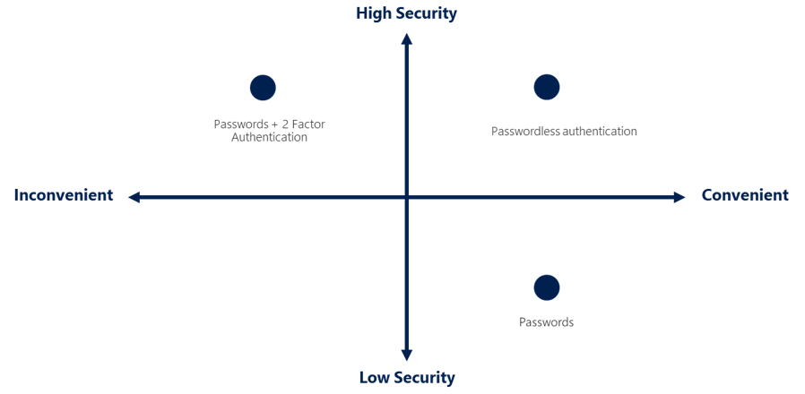

# Describe Azure authentication methods

## Authentication

- Authentication is the process of establishing the identity of a person, service, or device.
- It requires providing credentials to prove identity.
- Azure supports multiple authentication methods:
- Standard passwords
- Single sign-on (SSO)
- Multifactor authentication (MFA)
- Passwordless

## Security vs. Convenience

- New authentication solutions provide both security and convenience.
- The following diagram shows the security level compared to convenience:
- Passwordless authentication is high security and high convenience.
- Passwords on their own are low security but high convenience.
- Passwords + 2 Factor authentication is high security but low convenience.

## Single Sign-On (SSO)

- SSO enables a user to sign in once and access multiple resources and applications from different providers.
- Benefits of SSO:
- Remember only one ID and password
- Access across applications granted to a single identity
- Simplifies security model
- Easier to manage identities and access

**Important:** Single sign-on is only as secure as the initial authenticator.

## Multifactor Authentication (MFA)

- MFA prompts the user for an extra form of identification during sign-in.
- Helps protect against password compromise.
- Authentication factors:
- Something the user knows (e.g., challenge question)
- Something the user has (e.g., code sent to phone)
- Something the user is (e.g., biometric like fingerprint or face scan)
- MFA increases security by limiting the impact of credential exposure.
- Should be enabled wherever possible for added security benefits.

## Microsoft Entra Multifactor Authentication

- A Microsoft service that provides MFA capabilities.
- Enables users to choose an additional form of authentication during sign-in (e.g., phone call, mobile app notification).

## Passwordless Authentication

- Removes the password and replaces it with something you have, something you are, or something you know.
- Needs to be set up on a device before it can work.
- Microsoft offers three passwordless authentication options:
- Windows Hello for Business
- Microsoft Authenticator app
- FIDO2 security keys

### Windows Hello for Business

- Ideal for information workers with designated Windows PCs.
- Biometric and PIN credentials tied to the user's PC.
- Prevents access from anyone other than the owner.
- Provides seamless access to corporate resources on-premises and in the cloud.

### Microsoft Authenticator App

- Turns any iOS or Android phone into a passwordless credential.
- Users sign in by getting a notification on their phone, matching a number displayed, and using biometric or PIN to confirm.

### FIDO2 Security Keys

- An unphishable, standards-based passwordless authentication method.
- FIDO (Fast IDentity Online) promotes open authentication standards and reduces password use.
- FIDO2 security keys can be USB devices, Bluetooth, or NFC.
- Increases account security as there's no password to expose or guess.

## Next Unit: Describe Azure external identities
