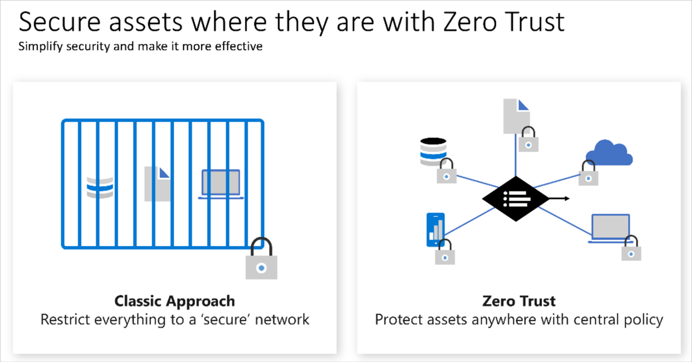

# Zero Trust Model

Zero Trust is a security model that assumes the worst-case scenario and protects resources with that expectation. Zero Trust assumes a breach at the outset and then verifies each request as though it originated from an uncontrolled network.

Today, organizations need a new security model that effectively adapts to the complexity of the modern environment, embraces the mobile workforce, and protects people, devices, applications, and data wherever they're located.

To address this new world of computing, Microsoft highly recommends the Zero Trust security model, which is based on these guiding principles:

## Guiding Principles

### Verify Explicitly

- Always authenticate and authorize based on all available data points.

### Use Least Privilege Access

- Limit user access with Just-In-Time and Just-Enough-Access (JIT/JEA), risk-based adaptive policies, and data protection.

### Assume Breach

- Minimize blast radius and segment access.
- Verify end-to-end encryption.
- Use analytics to get visibility, drive threat detection, and improve defenses.

## Adjusting to Zero Trust

Traditionally, corporate networks were restricted, protected, and generally assumed safe. Only managed computers could join the network, VPN access was tightly controlled, and personal devices were frequently restricted or blocked.

The Zero Trust model flips that scenario. Instead of assuming that a device is safe because it's within the corporate network, it requires everyone to authenticate. Then grants access based on authentication rather than location.

