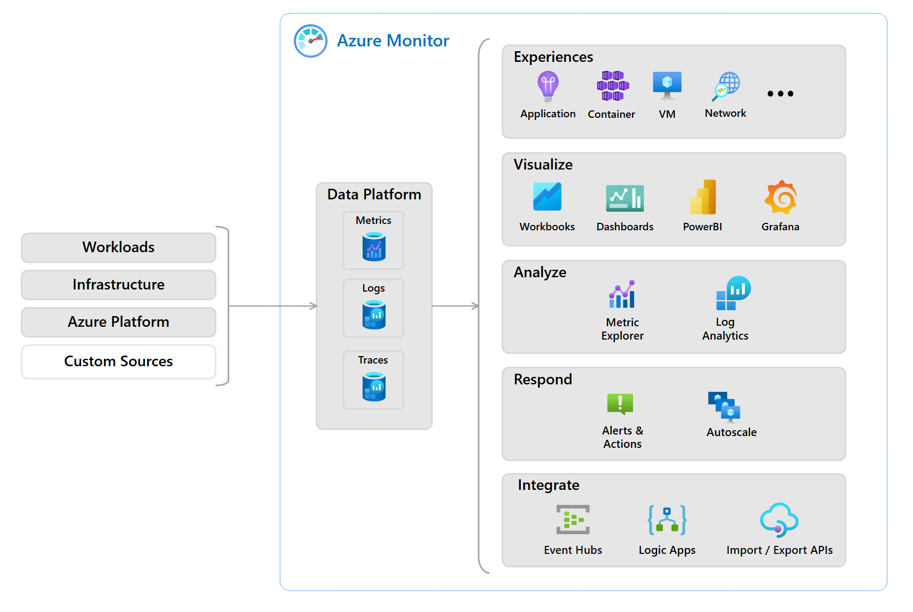
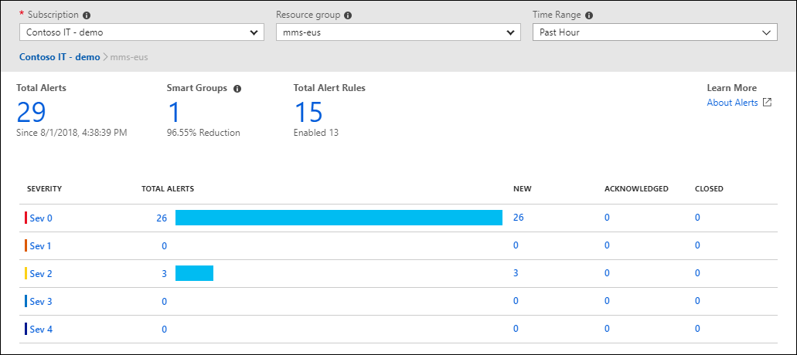

# **Describe Azure Monitor**

Azure Monitor is a platform for collecting data on your resources, analyzing that data, visualizing the information, and even acting on the results. Azure Monitor can monitor Azure resources, your on-premises resources, and even multi-cloud resources like virtual machines hosted with a different cloud provider.

The following diagram illustrates just how comprehensive Azure Monitor is:

On the left is a list of the sources of logging and metric data that can be collected at every layer in your application architecture, from application to operating system and network.

In the center, the logging and metric data are stored in central repositories.

On the right, the data is used in several ways. You can view real-time and historical performance across each layer of your architecture or aggregated and detailed information. The data is displayed at different levels for different audiences. You can view high-level reports on the Azure Monitor Dashboard or create custom views by using Power BI and Kusto queries.

Additionally, you can use the data to help you react to critical events in real time, through alerts delivered to teams via SMS, email, etc. Or you can use thresholds to trigger autoscaling functionality to scale to meet the demand.

## **Azure Log Analytics**

Azure Log Analytics is the tool in the Azure portal where you'll write and run log queries on the data gathered by Azure Monitor. Log Analytics supports simple and complex queries, and data analysis. You can write queries, sort/filter records, perform statistical analysis, visualize results, and more.

## **Azure Monitor Alerts**

Azure Monitor Alerts are an automated way to be notified when Azure Monitor detects a threshold being crossed. You set alert conditions, notification actions, and Azure Monitor Alerts notifies when triggered. Alerts can monitor logs or metrics and trigger based on conditions.

Alerts use action groups to configure notifications and actions. An action group specifies who to notify and what actions to take when an alert fires.

## **Application Insights**

Application Insights, an Azure Monitor feature, monitors web applications running in Azure, on-premises, or other clouds. You install an SDK or agent in your app to enable monitoring of request rates, response times, failures, dependencies, page views, user counts, performance counters and more.

Application Insights can also send periodic synthetic requests to test your application's availability and responsiveness.

## **Next unit: Knowledge check**
